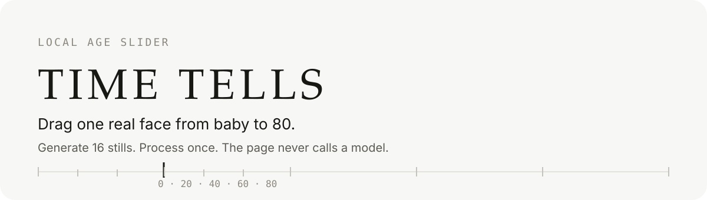
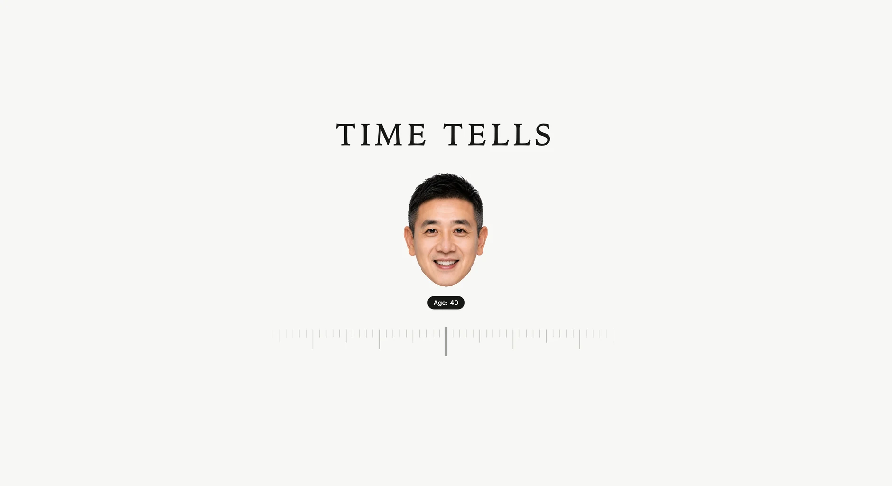
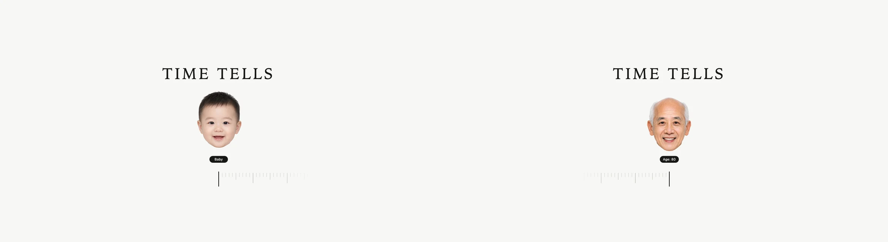
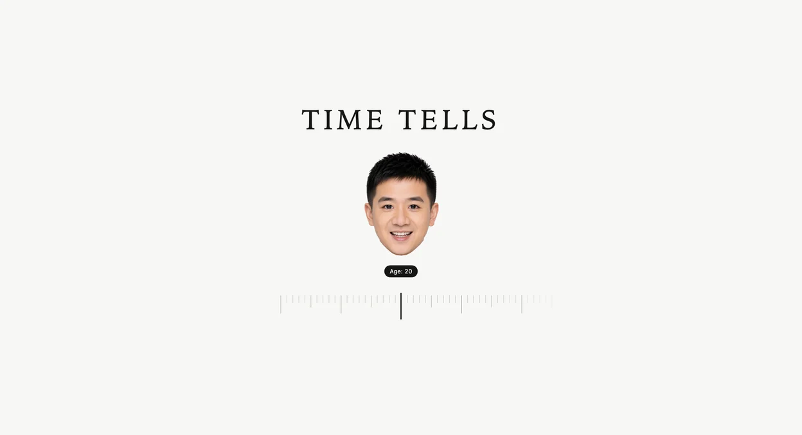
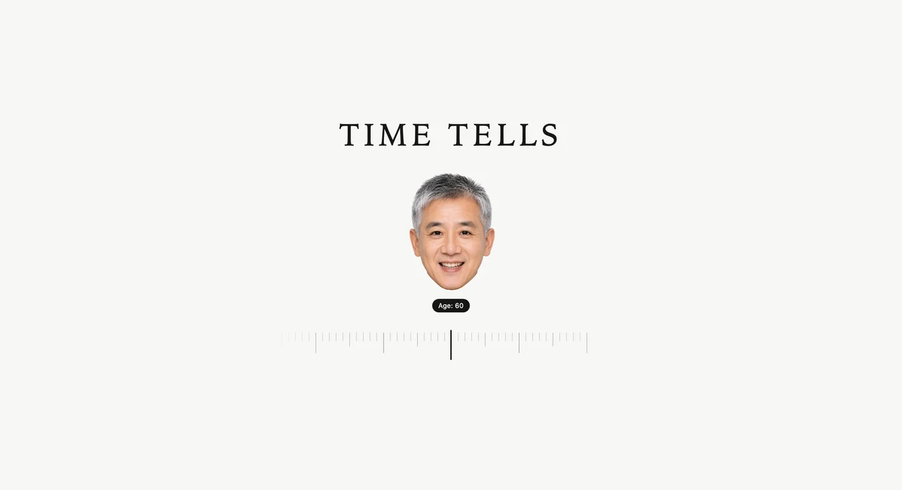
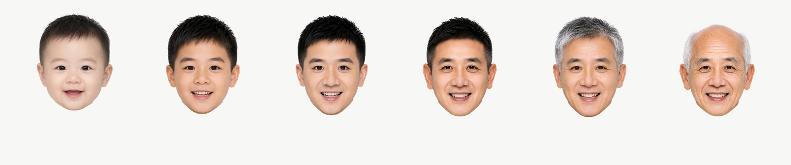
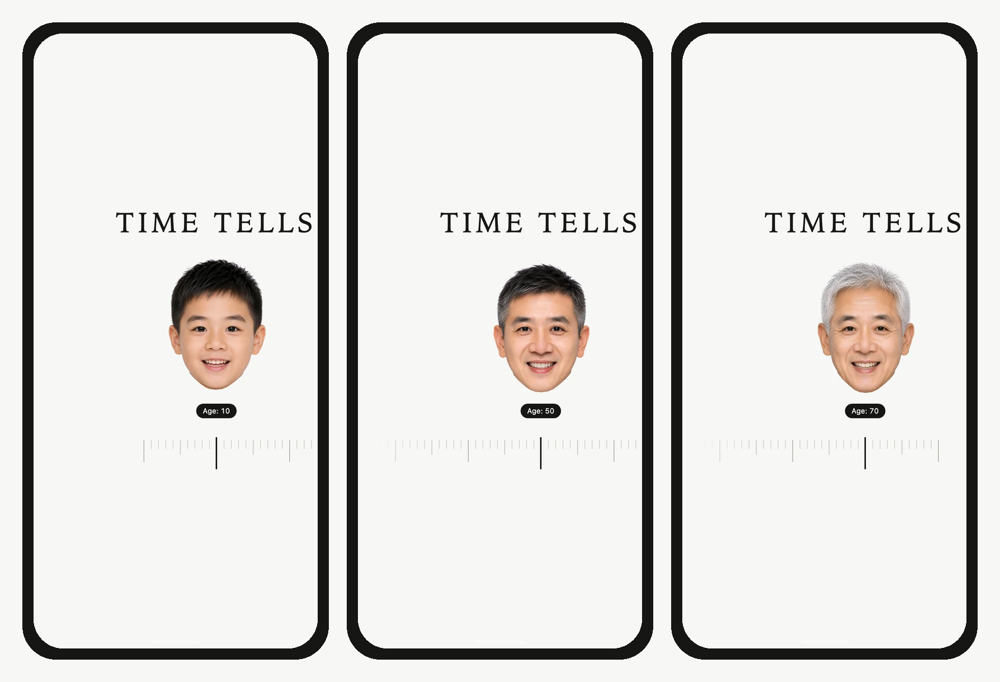
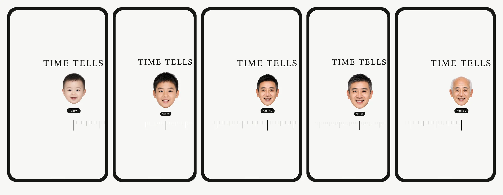
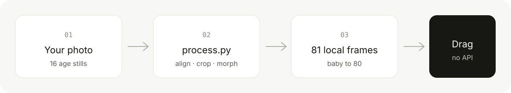

<p align="center">
  
</p>

一张正面照片，生 16 张年龄头，本地对齐裁切后，变成一条 Baby → 80 的尺。拖动时不调用任何生图模型。

公开产品只有「顺其自然」一条轨。

## 桌面

<p align="center">
  
</p>

<p align="center">
  
</p>

<p align="center">
  
  
</p>

<p align="center">
  
</p>

## 手机

390×844 是日常手机宽度。375×667 是产品验收下限。

<p align="center">
  
</p>

<p align="center">
  
</p>

## 它怎么工作

<p align="center">
  
</p>

1. 把 [`prompts/01-generate.md`](prompts/01-generate.md) 丢给会生图的 Agent，用你的正面单人照，**一张一张**生这 16 个年龄：

   `0, 5, 10, 15, 20, 25, 30, 35, 40, 45, 50, 55, 60, 65, 70, 80`

2. 把 [`prompts/02-install.md`](prompts/02-install.md) 丢给写代码的 Agent，或自己跑脚本。文件放进 `content/anchors/natural/`，然后：

```bash
python3 -m venv .venv
source .venv/bin/activate          # Windows: .\.venv\Scripts\Activate.ps1
python -m pip install -r pipeline/requirements.txt
python pipeline/process.py --check
python pipeline/process.py
```

脚本会锁定眼位、硬裁头部、补出 0–80 的中间岁，写到 `web/assets/frames/`。不要把 ChatGPT 原图直接当成网页帧。

## 先看演示

仓库里已经带着一套处理好的演示脸。本机打开：

```bash
cd web
python3 -m http.server 4175 --bind 127.0.0.1
```

访问 http://127.0.0.1:4175/

macOS、Windows、Linux 都可以跑处理脚本。只看演示页不需要装 Python 以外的东西。建议 Python 3.10 或 3.11。Windows 若 OpenCV / MediaPipe 导入失败，先装 [Visual C++ 运行库](https://learn.microsoft.com/en-us/cpp/windows/latest-supported-vc-redist)。

GitHub Pages 工作流在 `.github/workflows/pages.yml`。当前仓库若仍是 private，免费账号开不了 Pages；公开后在 Settings → Pages 选 GitHub Actions。

## 别人要改的目录

```
content/anchors/natural/   ← 只换这里的 16 张
pipeline/process.py        ← 对齐、裁切、补帧
web/                       ← 单页 + 81 张帧
prompts/                   ← 两段给 Agent 的说明书
```

## 许可

- 代码、网页、prompt：[MIT](LICENSE)
- 仓库里这套演示脸：可转载，**不能拿去做商业宣传**。见 [NOTICE.md](NOTICE.md)

这是视觉实验，不是体检或寿命预测。
